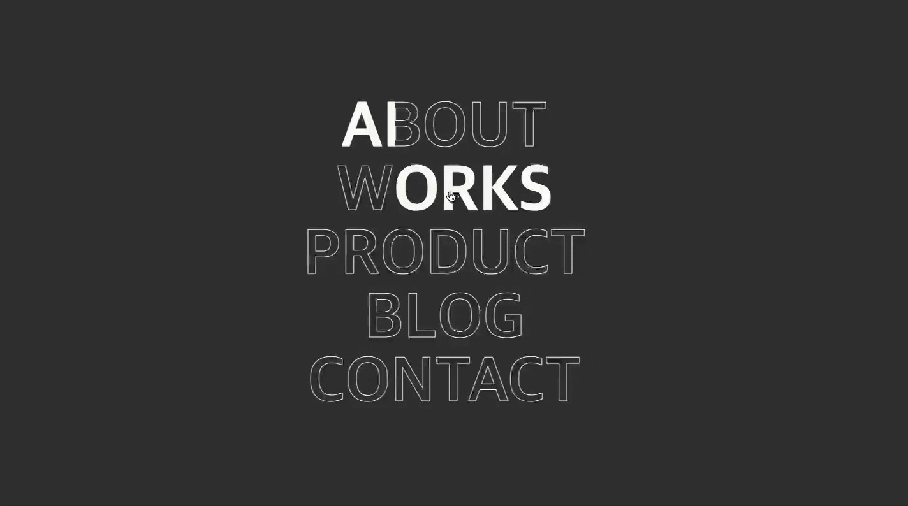

<h1 align="center">Animation with JS,CSS</h1>
<h3 align="center">Javascript를 활용한 웹사이트 애니매이션 효과</h3>
<br />

- 참고 : [맛있는 코딩 (yummy coding)](https://www.youtube.com/channel/UCyIn03aZJHoBIddySz9NKOA/featured)
  <br />


<h2 id="마우스호버"> :book: Mouse-Hover</h2>

  <br />

<p align="justify"> 
 기본적이지만, CSS 의 background-size 와 background-position 의 개념에 대해 몰랐었는데, 학습한 계기가 되었습니다. 그 외 background-image 에 대해 색상을 부여하는 방법을 익히게 되었습니다.
</p>
  <br />


<h2 id="버블 효과"> :book: Ripple-Effect</h2>

  <br />

<p align="justify"> 
 버튼의 효과를 주기 위해 3가지 정도의 개념을 활용하였습니다.
</p>
<br />

- 버튼(width _ height) 과 그의 after 요소에 절대치를 주어 원(radius _ 2)을 최대 길이로 생성
- 마우스로 버튼의 클릭 위치를 원의 중점에 오도록 설정 (getBoundingClientRect 활용 버튼 위에서의 상대위치 파악)
- 원의 위치를 동적으로 변경해주기 위한 style.setProperty 적용
  <br />

```js
const onClick = (e, button) => {
  const { x, y, width, height } = button.getBoundingClientRect();
  const radius = Math.sqrt(width * width + height * height);
  button.style.setProperty("--diameter", radius * 2 + "px");
  const { clientX, clientY } = e;
  const left = ((clientX - x - radius) / width) * 100 + "%";
  const top = ((clientY - y - radius) / height) * 100 + "%";
  button.style.setProperty("--left", left);
  button.style.setProperty("--top", top);
  button.style.setProperty("--a", ""); // 클릭때마다 속성을 지우고
  setTimeout(() => {
    // 지우고 다시 속성을 부여한다.
    button.style.setProperty("--a", "ripple-effect 500ms linear");
  });
};

btn.addEventListener("click", (e) => onClick(e, btn));
```

<br />

<p align="justify"> 
 버튼의 현재 위치를 파악하여 브라우저 왼쪽 상단부터 x, y를 측정합니다. 이후 피타고라스 정리를 활용하여 버튼의 대각선 길이를 반지름으로 가지는 원을 after 요소로 absolute 를 주어 생성합니다. 그리고 이 원의 중심을 클릭하는 점으로 동적으로 옮기기 위해 clientX, clientY 를 가져와서 위 식대로 계산합니다. <br />
 이렇게 계산된 프로퍼티 값을 동적으로 스타일에 적용시켜주고, 애니매이션을 적용합니다.
</p>
<br />

```css
button:after {
  content: "";
  position: absolute;
  top: var(--top);
  left: var(--left);
  width: var(--diameter);
  height: var(--diameter);
  transform: scale(0);
  background-color: rgba(255, 255, 255, 0.4);
  border-radius: 50%;
  pointer-events: none;
  animation: var(--a);
}

@keyframes ripple-effect {
  100% {
    transform: scale(1);
    opacity: 0;
  }
}
```

<br />


<h2 id="카드 효과"> :book: Card-Effect</h2>

  <br />

<p align="justify"> 
 카드에 마우스를 hover 시 일정 각도로 움직이는 카드를 만들 때, 몇가지 고려사항이 있습니다.
</p>
<br />
- 화면 내 요소(카드)의 위치파악을 위한 getBoundingClientRect 활용
- 마우스가 클릭하는 지점의 좌표를 파악하여야 하기에, 이를 위한 centerX, centerY 계산
- 동적으로 변경해주기 위한 style.setProperty 적용
- transform : rotate3d, boxshadow, backgroundImage : radial-gradient 속성을 동적으로 적용하기
- 화면 사이즈 변경에 따른 resize 시 새로 left, top 적용하기
  <br />

```js
let { x, y, width, height } = frame.getBoundingClientRect();

function mouseMove(e) {}

frame.addEventListener("mouseenter", () => {
  frame.addEventListener("mousemove", mouseMove);
});

frame.addEventListener("mouseleave", () => {
  frame.removeEventListener("mousemove", mouseMove);
});
```

<br />
<p align="justify"> 
 기본적으로 카드의 상대위치와, 마우스를 카드에 들어올때와 나갈때 상황에 따라, 이벤트를 추가했다가 지웠다가를 반복합니다. 이후 들어올 때의 마우스 위치에 따른 centerX, centerY 를 계산합니다.
</p>
<br />

```js
function mouseMove(e) {
  const left = e.clientX - x;
  const top = e.clientY - y;
  const centerX = left - width / 2;
  const centerY = top - height / 2;
  const d = Math.sqrt(centerX ** 2 + centerY ** 2);

  card.style.boxShadow = `
    ${-centerX / 5}px ${-centerY / 10}px 10px rgba(0, 0, 0, 0.2)
  `;

  card.style.transform = `
    rotate3d(
      ${-centerY / 100}, ${centerX / 100}, 0, ${d / 8}deg
    )
  `;

  light.style.backgroundImage = `
      adial-gradient(
      circle at ${left}px ${top}px, #00000040, #ffffff00, #ffffff99
    )
  `;
}
```

<br />
<p align="justify"> 
 여기서 rotate3d 의 y 속성에 왜 - 가 붙냐면, 카드 중심점으로 부터 동남 방향의 지점을 rotate3d 가 해석하려면 y 가 - 여야 하는데,<br />위에서 구한 centerY 의 경우 + 값이 나오게 됩니다. 따라서 이를 처리하기 위해 붙여줍니다.<br /> 나머지 속성값들도 비슷한 이유입니다. 속성값이 너무 크면 나눠주어 각도를 조절해주고, 피타고라스를 통해 카드가 숙여지는 각도를 동적으로 조절합니다.
</p>
<br />

```js
window.addEventListener("resize", () => {
  rect = frame.getBoundingClientRect();
  x = rect.x;
  y = rect.y;
  width = rect.width;
  height = rect.height;
});
```

<br />
<p align="justify"> 
 마지막으로 화면의 사이즈가 변경될 때 마다 새롭게 좌표를 설정해줍니다.
</p>
<br />


